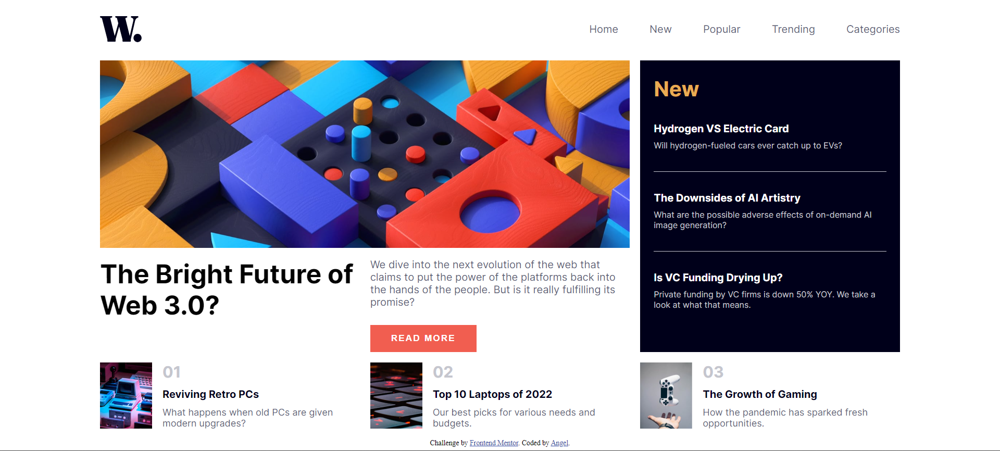

# Frontend Mentor - News homepage solution

This is a solution to the [News homepage challenge on Frontend Mentor](https://www.frontendmentor.io/challenges/news-homepage-H6SWTa1MFl). Frontend Mentor challenges help you improve your coding skills by building realistic projects. 

## Table of contents

- [Overview](#overview)
  - [The challenge](#the-challenge)
  - [Screenshot](#screenshot)
  - [Built with](#built-with)
  - [What I learned](#what-i-learned)
  - [Continued development](#continued-development)
  - [Useful resources](#useful-resources)
- [Author](#author)

**Note: Delete this note and update the table of contents based on what sections you keep.**

## Overview
This is the hardest challange I've done in this app so far. Because I've had to go through different tecnologies such as CSS Grid, Flexbox, Javascript, etc.

I've learned a lot and practice new skills doing this challange that's why I feel grateful with this challange since it has helped getting new knowledge.

### The challenge

Users should be able to:

- View the optimal layout for the interface depending on their device's screen size
- See hover and focus states for all interactive elements on the page

### Screenshot




### Built with

- Semantic HTML5 markup
- CSS custom properties
- Flexbox
- CSS Grid
- Javascript

### What I learned

```css
.visible {
        opacity: 1;
        visibility: visible;
      }

      .main-section img { 
      width: 100%;
      height: 100%;
      object-fit: cover;
      grid-column: 1/3;
      grid-row: 1/2;
    }

    .nav {
        opacity: 0;
        visibility: hidden; 
        position: absolute;
        top: 0;
        right: 0;
        bottom: 0;
        background-color: #fff;
        width: 60%;
        box-shadow: 0 0 0 100vmax #0006;
      }

```
```js
    const nav = document.querySelector("#nav");
    const openMenu = document.querySelector("#open-menu");
    const closeMenu = document.querySelector("#close-menu");

    openMenu.addEventListener("click", () => {
      nav.classList.add("visible");
    })

    closeMenu.addEventListener("click", () => {
      nav.classList.remove("visible");
    })
```

### Continued development

- CSS Grid
- Javascript

### Useful resources

- [Ham Menu](https://www.youtube.com/watch?v=Xs3cC8-5QDI) - This helped me with the Ham menu

## Author

- Frontend Mentor - [@ProgrAngel](https://www.frontendmentor.io/profile/pr0g4ng3l)
- Instagram - [@angel_http404](https://www.instagram.com/angel_http404/)
- Linkedin - [Angel Ivan Henríquez Martínez](https://www.linkedin.com/in/angel-ivan-henr%C3%ADquez-mart%C3%ADnez-16a6b6218/)